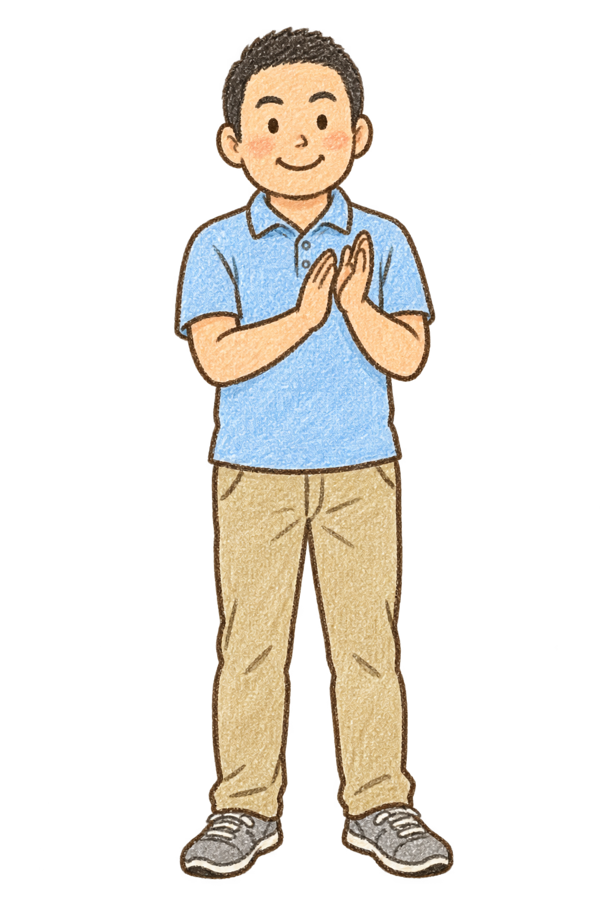

# キャラクター紐付け一覧

更新日: 2026-09-25

## 共通ルール

- 正式IDは spectator_01 〜 spectator_11。
- spectator_man_01 は spectator_11 に統合済みです。
- 観戦用は正面の静止カットを使用します。
- 歩行用は同じIDの 正面・右向き・左向き・後ろ向き を1セットとして扱います。
- mall_walker_01 〜 mall_walker_06 は経路スロットIDです。表示する人物プロフィールは出現時に切り替えられます。

## プロフィール一覧

| 正式ID | 表示名 | 旧ID | 観戦用（正面） | 歩行用：正面 | 右向き | 左向き | 後ろ向き |
| --- | --- | --- | --- | --- | --- | --- | --- |
| spectator_01 | イエローカーディガンの来場者 | — | spectator-01-handdrawn.png | 生成予定 | 生成予定 | 生成予定 | 生成予定 |
| spectator_02 | 白いジャケットの来場者 | — | spectator-02-front-handdrawn.png | 生成予定 | 生成予定 | 生成予定 | 生成予定 |
| spectator_03 | 子どもの来場者 01 | — | spectator-03-handdrawn.png | 生成予定 | 生成予定 | 生成予定 | 生成予定 |
| spectator_04 | 子どもの来場者 02 | — | spectator-04-handdrawn.png | 生成予定 | 生成予定 | 生成予定 | 生成予定 |
| spectator_05 | 来場者 05 | — | spectator-05-handdrawn.png | 生成予定 | 生成予定 | 生成予定 | 生成予定 |
| spectator_06 | 来場者 06 | — | spectator-06-handdrawn.png | 生成予定 | 生成予定 | 生成予定 | 生成予定 |
| spectator_07 | 来場者 07 | — | spectator-07-handdrawn.png | 生成予定 | 生成予定 | 生成予定 | 生成予定 |
| spectator_08 | 来場者 08 | — | spectator-08-handdrawn.png | 生成予定 | 生成予定 | 生成予定 | 生成予定 |
| spectator_09 | 来場者 09 | — | spectator-09-handdrawn.png | 生成予定 | 生成予定 | 生成予定 | 生成予定 |
| spectator_10 | 来場者 10 | — | spectator-10-handdrawn.png | 生成予定 | 生成予定 | 生成予定 | 生成予定 |
| spectator_11 | 男性来場者 01 | spectator_man_01 | spectator-11-handdrawn.png | 生成予定 | 生成予定 | 生成予定 | 生成予定 |

## 観戦用の確認画像

| ID | 画像 |
| --- | --- |
| spectator_01 |  |
| spectator_02 |  |
| spectator_03 |  |
| spectator_04 |  |
| spectator_05 |  |
| spectator_06 |  |
| spectator_07 |  |
| spectator_08 |  |
| spectator_09 |  |
| spectator_10 |  |
| spectator_11 |  |

## 歩行スロット

| スロットID | 通路内の位置 | 表示プロフィール | 経路 |
| --- | --- | --- | --- |
| mall_walker_01 | ショップ寄り | 出現時に切替 | 開始 → 中央A → 中央B → 終点 |
| mall_walker_02 | ショップ寄り | 出現時に切替 | 開始 → 中央A → 中央B → 終点 |
| mall_walker_03 | 中央 | 出現時に切替 | 開始 → 中央A → 中央B → 終点 |
| mall_walker_04 | 中央 | 出現時に切替 | 開始 → 中央A → 中央B → 終点 |
| mall_walker_05 | ゲームフィールド寄り | 出現時に切替 | 開始 → 中央A → 中央B → 終点 |
| mall_walker_06 | ゲームフィールド寄り | 出現時に切替 | 開始 → 中央A → 中央B → 終点 |

> 歩行4方向の画像を追加する際は、プロフィール表の「生成予定」を実ファイル名へ置き換えます。